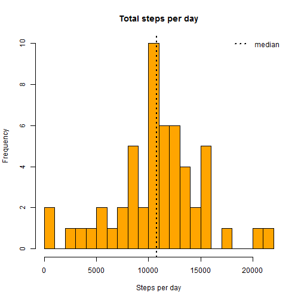
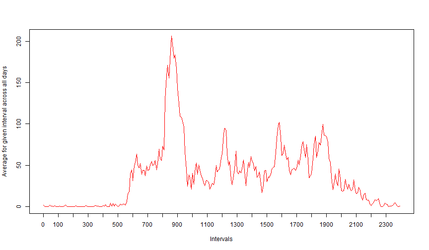
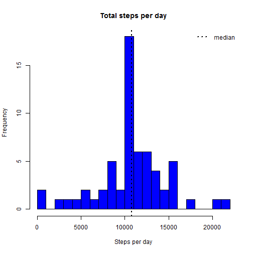
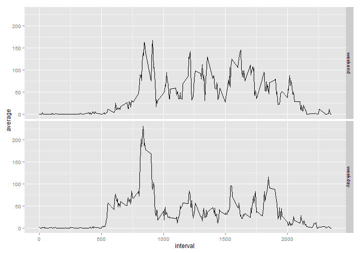

## 1. Code for reading in the dataset and/or processing the data


```r
unzip("activity.zip",exdir = "data")
```
Read- data into activity data frame > summary statistics

```r
activity <- read.csv("data/activity.csv", stringsAsFactors=FALSE)
str(activity)
```

```
## 'data.frame':	17568 obs. of  3 variables:
##  $ steps   : int  NA NA NA NA NA NA NA NA NA NA ...
##  $ date    : chr  "2012-10-01" "2012-10-01" "2012-10-01" "2012-10-01" ...
##  $ interval: int  0 5 10 15 20 25 30 35 40 45 ...
```

```r
summary(activity)
```

```
##      steps            date              interval     
##  Min.   :  0.00   Length:17568       Min.   :   0.0  
##  1st Qu.:  0.00   Class :character   1st Qu.: 588.8  
##  Median :  0.00   Mode  :character   Median :1177.5  
##  Mean   : 37.38                      Mean   :1177.5  
##  3rd Qu.: 12.00                      3rd Qu.:1766.2  
##  Max.   :806.00                      Max.   :2355.0  
##  NA's   :2304
```


```r
require(dplyr)
total_day <- activity %>% group_by(date) %>%summarise(total_steps=sum(steps,na.rm=TRUE),na=mean(is.na(steps))) %>% print
```

```
## Source: local data frame [61 x 3]
## 
##          date total_steps na
## 1  2012-10-01           0  1
## 2  2012-10-02         126  0
## 3  2012-10-03       11352  0
## 4  2012-10-04       12116  0
## 5  2012-10-05       13294  0
## 6  2012-10-06       15420  0
## 7  2012-10-07       11015  0
## 8  2012-10-08           0  1
## 9  2012-10-09       12811  0
## 10 2012-10-10        9900  0
## ..        ...         ... ..
```

##  2. Histogram of the total number of steps taken each day

The Histogram does not contain days where all observations are missing. There would be about ten days with 0 steps.  

```r
total_day <- filter(total_day, na < 1)
hist(total_day$total_steps,col="orange",breaks=20,main="Total steps per day",xlab="Steps per day")
abline(v=median(total_day$total_steps),lty=3, lwd=2, col="black")
legend(legend="median","topright",lty=3,lwd=2,bty = "n")
```

 

## 3. Mean and median number of steps taken each day


```r
mean_steps <- mean(total_day$total_steps,na.rm=TRUE)
median_steps <- median(total_day$total_steps,na.rm=TRUE)
```
1. Mean (total number of steps taken each day)= 1.076619 &times; 10<sup>4</sup> steps.

2. Median (total number of steps taken each day)= 10765 steps, 

## 4. Time series plot of the average number of steps taken


```r
library(dplyr,quietly = TRUE)
daily_patterns <- activity %>% group_by(interval) %>% summarise(average=mean(steps,na.rm=TRUE))
plot(x = 1:nrow(daily_patterns),y = daily_patterns$average,type = "l",
     col = "red", xaxt = "n",xlab="Intervals", 
     ylab = "Average for given interval across all days")
axis(1,labels=daily_patterns$interval[seq(1,288,12)],
     at = seq_along(daily_patterns$interval)[seq(1,288,12)])
```

 

## 5. The 5-minute interval that, on average, contains the maximum number of steps

```r
max_numb_steps_interval <- filter(daily_patterns,average==max(average))
```

Interval "835" contains on average the maximum number of steps (**206.17 steps**).


## 6. Code to describe and show a strategy for imputing missing data


```r
na_number <- sum(is.na(activity$steps))
na_number
```

```
## [1] 2304
```

```r
percentage_na <- mean(is.na(activity$steps))
percentage_na
```

```
## [1] 0.1311475
```
Total number of missing values in the dataset = **2304 ** (Which actually is **13.1** % of total observations).

####  Devise a strategy for filling in all of the missing values in the dataset


The number of missing values in the given dataset is large. Hence we are not sure whether any bias is introduced by the missing values.
So, we need to input mssing values. This would be based on the average steps in 5-minutes interval.

#### Create a new dataset that is equal to the original dataset but with the missing data filled in.

```r
without_NAs <- numeric(nrow(activity))
for (i in 1:nrow(activity))
{
        if (is.na(activity[i,"steps"])==TRUE)
            {
                    without_NAs[i]<-filter(daily_patterns,interval==activity[i,"interval"]) %>% select(average)
            } 
        else
            {
                    without_NAs[i]<-activity[i,"steps"]
            }
                    
}
activity_without_NAs<-mutate(activity,steps_no_NAs=without_NAs)
head(activity_without_NAs)
```

```
##   steps       date interval steps_no_NAs
## 1    NA 2012-10-01        0     1.716981
## 2    NA 2012-10-01        5    0.3396226
## 3    NA 2012-10-01       10    0.1320755
## 4    NA 2012-10-01       15    0.1509434
## 5    NA 2012-10-01       20    0.0754717
## 6    NA 2012-10-01       25      2.09434
```

Code written below is to verify if process of inputing missing values does not disrupt the original values (lines with no NAs)   

```r
check <- filter(activity_without_NAs,!is.na(steps)) %>% mutate(ok = (steps==steps_no_NAs))
mean(check$ok)
```

```
## [1] 1
```

## 7. Histogram of the total number of steps taken each day after missing values are imputed


```r
total_day_noNAs <- activity_without_NAs %>% mutate(steps_no_NAs=as.numeric(steps_no_NAs)) %>% group_by(date) %>% summarise(total_steps=sum(steps_no_NAs))
hist(total_day_noNAs$total_steps,col="blue",breaks=20,main="Total steps per day",xlab="Steps per day")
abline(v=median(total_day$total_steps),lty=3, lwd=2, col="black")
legend(legend="median","topright",lty=3,lwd=2,bty = "n")
```

 


```r
summary(total_day_noNAs$total_steps)
```

```
##    Min. 1st Qu.  Median    Mean 3rd Qu.    Max. 
##      41    9819   10770   10770   12810   21190
```

Imputing missing values, mean of the total number of steps taken per day  increased while median decreased,compared to estimates from the first part (ingoring missing values). Input of  missing data resulted in increase of total daily number of steps 
(instead of each NAs we have average that is always >=0)

### Are there differences in activity patterns between weekdays and weekends?

#### 1. Create a new dataset that is equal to the original dataset but with the missing data filled in.


```r
library(lubridate)
is_weekday <-function(date){
        if(wday(date)%in%c(1,7)) result<-"weekend"
        else
                result<-"weekday"
        result
}

activity_without_NAs <- mutate(activity_without_NAs,date=ymd(date)) %>% mutate(day=sapply(date,is_weekday))

table(activity_without_NAs$day)
```

```

## weekday weekend 
##   12960    4608
```

## 8. Panel plot comparing the average number of steps taken per 5-minute interval across weekdays and weekends


```r
library(ggplot2)
daily_patterns <- activity_without_NAs %>% mutate(day=factor(day,levels=c("weekend","weekday")),steps_no_NAs=as.numeric(steps_no_NAs)) %>% group_by(interval,day) %>% summarise(average=mean(steps_no_NAs))
qplot(interval,average,data=daily_patterns,geom="line",facets=day~.)
```

 
